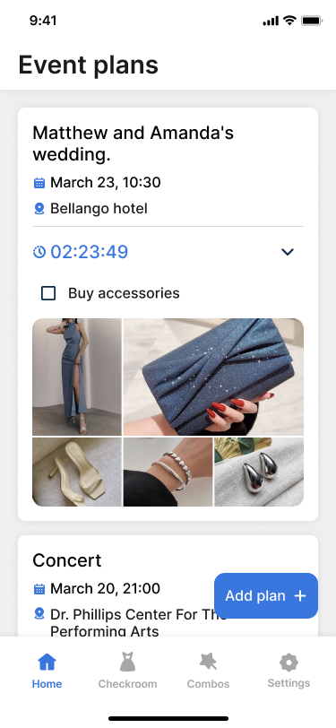
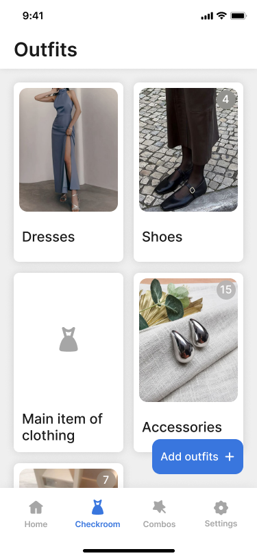
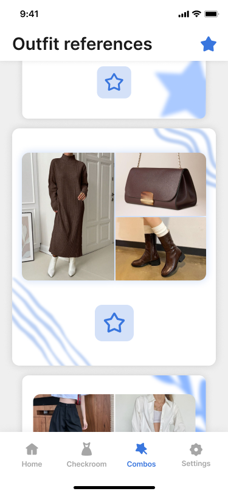

# EventVibe: Create & Impress

**EventVibe** is a Flutter app for planning upcoming events and organizing your outfits to make a lasting impression. Curate your wardrobe, prepare visual combos, and never forget a stylish detail again.


## 🛠️ Technologies

- **Flutter** and **Dart**
- **Provider** — state management
- **Hive** — local storage
- **Flutter ScreenUtil** — responsive design
- **Custom UI elements** — card views, category filters, outfit collages
- **Local assets** — photos, clothing, and references

## 📱 Screenshots

| Event Planner | Checkroom | Outfit Combos |
|---------------|-----------|----------------|
|  |  |  |

## 🚀 How to Run

1. Clone the repo
   ```sh
   git clone https://github.com/NMMustafina/eventvibe_create_impress.git
   ```
2. Install all the packages by typing the following command
   ```sh
   flutter pub get
   ```
3. Run the App
